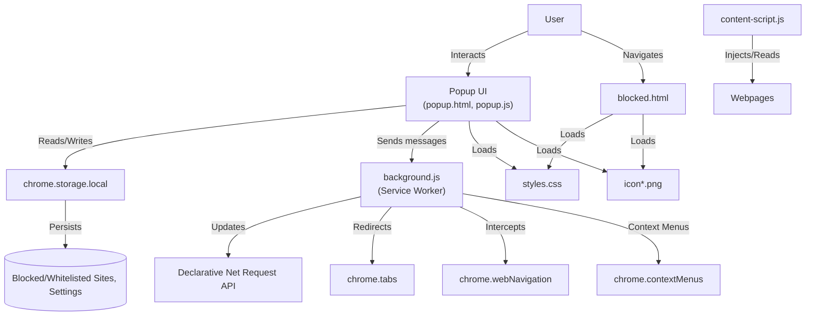
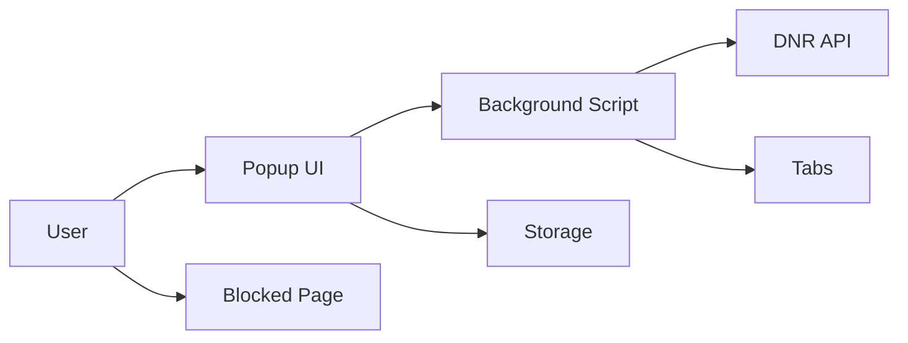

# Website Blocker Pro – Documentation

## Table of Contents

- [Project Overview](#project-overview)
- [System & Software Architecture](#system--software-architecture)
- [Codebase Structure](#codebase-structure)
- [Setup, Deployment, and Configuration](#setup-deployment-and-configuration)
- [Component & File Documentation](#component--file-documentation)
- [API & Integration Documentation](#api--integration-documentation)
- [Testing & Quality Assurance](#testing--quality-assurance)
- [Extensibility & Customization](#extensibility--customization)
- [Troubleshooting & FAQs](#troubleshooting--faqs)
- [Contribution Guidelines](#contribution-guidelines)

---

## Project Overview

**Website Blocker Pro** is a Chrome extension that empowers users to block distracting or unwanted websites, manage whitelists, organize sites by category, and boost productivity with features like a focus timer and activity dashboard. The extension is built with Manifest V3, prioritizing security, privacy, and performance. All user data is stored locally.

**Key Features:**
- Block/Unblock websites instantly
- Persistent blocking (even after refresh or direct navigation)
- Whitelist management
- Category organization
- Focus timer and productivity dashboard
- Custom block page
- Responsive, accessible UI with dark mode and accent color
- Local storage (no cloud sync by default)
- CSV import/export for migration/backup

---

## System & Software Architecture

### Detailed Architecture Diagram



### Simple Overview Diagram



### Technologies Used

- **Chrome Extensions API (Manifest V3)**
- **JavaScript (ES6+)**
- **HTML5/CSS3** (responsive, accessible, themable)
- **Chrome Storage API** (local)
- **Declarative Net Request API** (for blocking)
- **Web Navigation, Tabs, Context Menus APIs**
- **Service Worker** (background.js)

### Design Patterns

- **Modularization:** Each feature is encapsulated in its own function/module.
- **Event-driven:** Listeners for UI, storage, and browser events.
- **Separation of Concerns:** UI logic (popup.js), background logic (background.js), content script (content-script.js), and configuration (manifest.json) are separated.

---

## Codebase Structure

```
website-blocker-extension/
├── manifest.json          # Extension configuration and permissions
├── background.js          # Service worker: blocking logic, DNR rules, context menus
├── popup.html             # Popup UI markup
├── popup.js               # Popup UI logic, storage, settings, dashboard
├── styles.css             # Shared styles for popup and block page
├── blocked.html           # Custom block page shown to user
├── blocked.js             # Logic for block page (if any)
├── content-script.js      # Injected into web pages (if needed)
├── icon*.png              # Extension icons (various sizes)
├── README.md              # Project documentation
└── .gitignore, etc.       # Project config files
```

---

## Setup, Deployment, and Configuration

### Prerequisites

- Google Chrome (latest version recommended)
- Node.js & npm (for development, optional)
- Git (for version control)

### Installation (Development)

1. Clone the repository:
   ```sh
   git clone https://github.com/yourusername/website-blocker-extension.git
   ```
2. Open Chrome and go to `chrome://extensions/`
3. Enable **Developer mode**
4. Click **Load unpacked** and select the `website-blocker-extension` folder

### Deployment

- **Manual:** Zip the extension folder and upload to the Chrome Web Store (follow [official guide](https://developer.chrome.com/docs/webstore/publish/)).
- **CI/CD:** (If configured) Use GitHub Actions or similar to lint, test, and package the extension for release.

### Configuration

- All settings are managed via the popup UI and stored in `chrome.storage.local`.
- No environment variables required for local use.

---

## Component & File Documentation

### manifest.json

> **Summary:**  
> Declares extension metadata, permissions, background scripts, content scripts, icons, and web-accessible resources.

- **Permissions:**  
  - `storage`, `declarativeNetRequest`, `webNavigation`, `notifications`, `contextMenus`, `commands`
- **Host Permissions:**  
  - `<all_urls>` (to block any site)
- **Background:**  
  - `background.js` as service worker
- **Content Scripts:**  
  - `content-script.js` (optional, for page-level features)
- **Action:**  
  - `popup.html` as the default popup

### background.js

> **Summary:**  
> Service worker that manages blocking logic, DNR rules, context menu actions, and responds to storage and navigation events.

**Key Functions:**
- `syncDNRRules()`: Syncs the block list with Chrome's DNR API.
- Event listeners for:
  - `chrome.runtime.onStartup` / `onInstalled`: Initialize rules.
  - `chrome.storage.onChanged`: Update rules on blocklist change.
  - `chrome.webNavigation.onBeforeNavigate`: Redirect to block page.
  - `chrome.contextMenus`: Add/remove context menu items.

**Error Handling:**  
- Handles duplicate context menu IDs gracefully.
- Logs errors to the console and (optionally) to the popup debug panel.

**Edge Cases:**  
- Ensures no duplicate DNR rules.
- Handles race conditions on storage updates.

### popup.html

> **Summary:**  
> The main user interface for managing blocked/whitelisted sites, settings, and viewing stats.

- **ARIA roles and labels** for accessibility.
- **Responsive design** for mobile/desktop.
- **Dark mode** and **accent color** support.
- **Tab-based navigation** for features (Blocking, Whitelist, Categories, Dashboard, Settings).

### popup.js

> **Summary:**  
> Handles all popup UI logic, including site management, settings, dashboard, notifications, and accessibility.

**Key Functions:**
- `addSite()`, `removeSite()`: Manage block list.
- `addWhitelistSite()`, `removeWhitelistSite()`: Manage whitelist.
- `loadSites()`, `loadWhitelist()`, `loadCategories()`: Render UI from storage.
- `syncDNRRules()`: Request background to update DNR rules.
- `showNotification()`: User feedback.
- `initializeDarkMode()`, `initializeAccentColor()`: Theming.
- `addActivity()`: Log user actions for dashboard.
- **Keyboard navigation** and ARIA for accessibility.

**Error Handling:**  
- Validates domain input.
- Handles storage errors and notifies user.

**Edge Cases:**  
- Prevents duplicate entries.
- Handles empty/invalid input gracefully.

**Inline Comments:**  
- Complex logic and event handlers are commented for clarity.

### styles.css

> **Summary:**  
> Provides all styling for popup and block page, including responsive layouts, dark mode, accent color, and animations.

- Uses CSS variables for theming.
- Media queries for responsiveness.
- Animations for tab transitions and notifications.
- High-contrast and accessible color choices.

### blocked.html & blocked.js

> **Summary:**  
> Custom page shown when a user tries to access a blocked site.

- Explains why the site is blocked.
- Optionally provides a way to request unblock (if enabled).

### content-script.js

> **Summary:**  
> (Optional) Injected into web pages for advanced features (e.g., hiding page content before redirect).

---

## API & Integration Documentation

### Chrome APIs Used

| API                        | Purpose                                 | Key Methods/Events Used                |
|----------------------------|-----------------------------------------|----------------------------------------|
| `chrome.storage.local`     | Store block/whitelist/settings          | `get`, `set`, `onChanged`              |
| `chrome.declarativeNetRequest` | Block network requests             | `updateDynamicRules`, `getDynamicRules` |
| `chrome.webNavigation`     | Intercept navigation                    | `onBeforeNavigate`                     |
| `chrome.tabs`              | Redirect tabs, update UI                | `update`, `onUpdated`                  |
| `chrome.contextMenus`      | Add right-click menu for quick block    | `create`, `removeAll`                  |
| `chrome.notifications`     | User notifications                      | `create`                               |
| `chrome.commands`          | Keyboard shortcuts                      | `_execute_action`, `quick-add-site`    |

### Integration Points

- **No third-party services** by default (privacy-focused).
- **CSV Import/Export:** For migration and backup (UI-driven, not API).

---

## Testing & Quality Assurance

### Testing Strategies

- **Manual Testing:**  
  - Add/remove sites, test block/unblock, whitelist, settings, and dashboard.
  - Test on multiple Chrome versions and OSes.
- **Automated Testing:**  
  - (If present) Use Jest or Mocha for unit tests on logic modules.
- **Linting:**  
  - Use ESLint for code quality.

### Running Tests

- Manual:  
  - Load extension in Chrome, use all features, check for errors in popup and background.
- Automated:  
  - Run `npm test` (if test suite exists).

### Coverage Expectations

- All core logic (blocking, storage, UI) should be covered.
- Edge cases (invalid input, duplicate domains, race conditions) should be tested.

---

## Extensibility & Customization

### Adding New Features

- **New UI Features:**  
  - Add new tab/section in `popup.html` and corresponding logic in `popup.js`.
- **New Blocking Logic:**  
  - Update `background.js` and DNR rule generation.
- **Settings:**  
  - Add new fields to settings section in popup and handle in storage.

### Conventions

- Use ES6+ syntax.
- Add docstrings and inline comments for all new functions/modules.
- Follow existing file/module structure.
- Test thoroughly before submitting PRs.

---

## Troubleshooting & FAQs

### Common Issues & Solutions

| Problem                                 | Solution                                                                 |
|------------------------------------------|--------------------------------------------------------------------------|
| Extension not blocking sites             | Check if enabled, verify domain format, reload extension, check console  |
| Sites still accessible after blocking    | Ensure correct domain, try direct navigation, clear cache                |
| Extension not loading                    | Check for missing files, manifest errors, Chrome version                 |
| Debug info needed                        | Use popup debug panel for rules/status                                   |

### FAQs

**Q: Can I block subdomains?**  
A: Yes, blocking `facebook.com` will also block `www.facebook.com` and other subdomains.

**Q: Where is my data stored?**  
A: All data is stored locally in your browser via `chrome.storage.local`.

**Q: How do I migrate my block list?**  
A: Use the CSV export/import feature in the popup.

---

## Contribution Guidelines

### How to Contribute

1. Fork the repository
2. Create a feature branch
3. Make your changes (with docstrings and comments)
4. Test thoroughly
5. Submit a pull request

### Coding Standards

- Use 2-space indentation
- ES6+ JavaScript
- Add docstrings and inline comments for all new code
- Test on multiple platforms

### Review Process

- All PRs are reviewed for code quality, documentation, and test coverage.
- Automated checks (linting/tests) must pass before merge.

---

# Example Docstring and Inline Comment Style

```js
/**
 * Adds a domain to the block list and updates DNR rules.
 * @param {string} domain - The domain to block (must be normalized).
 * @param {string} category - Optional category for the domain.
 * @returns {Promise<void>}
 * @throws {Error} If storage update fails.
 * @example
 *   addSite('facebook.com', 'social');
 */
function addSite(domain, category = 'other') {
  // Validate input
  if (!domain) throw new Error('Domain is required');
  // ...rest of logic
}
```

---

This documentation is designed to be a living document. Please update it as the codebase evolves! If you need file-by-file docstring templates or more detailed diagrams, let me know.
