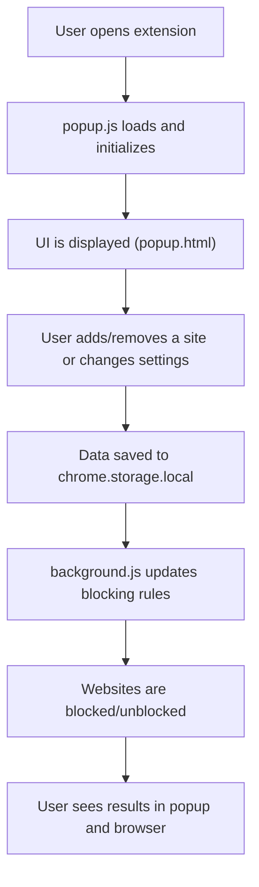

# Welcome to Website Blocker Pro – Beginner Code Navigation Guide

## 👋 Welcome and Quick Start

Welcome! This project is a Chrome extension that helps you block distracting websites, manage whitelists, and boost your productivity. If you’re new to the codebase, this guide will help you get started quickly and confidently.

---

## 🚦 How to Get Started

**Step 1: Open the Entry Point File**

- **Start with `popup.js`**
  - This file controls the main user interface (the popup you see when you click the extension icon in Chrome).
  - It’s the best place to begin because it shows how users interact with the extension and how the core features work.

**Why `popup.js`?**
- It connects the UI (popup.html) to the extension’s logic.
- It manages adding/removing blocked sites, settings, and user actions.
- Understanding this file gives you a solid foundation for the rest of the codebase.

**Other Important Files to Explore Next:**
- `popup.html` – The structure/layout of the popup window.
- `background.js` – Handles background tasks like blocking sites and updating rules.
- `styles.css` – Controls the look and feel of the popup and block page.

---

## 🗂️ Codebase Structure Overview

```
website-blocker-extension/
├── popup.js         # Main UI logic (start here!)
├── popup.html       # Popup window structure
├── background.js    # Background logic and blocking
├── styles.css       # Styling for popup and block page
├── manifest.json    # Extension configuration
├── blocked.html     # Page shown when a site is blocked
├── content-script.js# (Optional) Injected into web pages
├── icon*.png        # Extension icons
```

- **Start with `popup.js`** for the main logic.
- Use `popup.html` to see how the UI is built.
- Check `background.js` for how blocking works behind the scenes.

---

## 📖 Glossary of Key Terms & Files

- **popup.js**: The main JavaScript file for the popup UI. Handles user actions, storage, and updates the interface.
- **popup.html**: The HTML file for the popup window. Defines the layout and elements you see.
- **background.js**: Runs in the background. Manages blocking rules and listens for browser events.
- **styles.css**: Styles for the popup and block page (colors, layout, dark mode, etc.).
- **manifest.json**: The configuration file for the Chrome extension (permissions, scripts, icons).
- **blocked.html**: The page users see when they try to visit a blocked site.
- **chrome.storage.local**: Where the extension saves your settings and blocked sites (built-in Chrome storage).
- **DNR (Declarative Net Request)**: Chrome’s API for blocking websites efficiently.

---

## 💡 Tips for Navigating the Code

- **Don’t try to read everything at once!** Start with `popup.js` and follow the flow of user actions.
- **Use search:** Look for function names like `addSite`, `removeSite`, or `syncDNRRules` to find where things happen.
- **Check comments:** Many functions have comments explaining what they do.
- **Experiment:** Try making small changes and reload the extension in Chrome to see what happens.
- **Ask for help:** If you get stuck, look for documentation or ask a more experienced developer.

---

## 🔄 Code Flow Visualization

### Main User Flow (Popup)



### How the Flow Works (in simple terms):
- When you open the extension, `popup.js` runs and sets up the UI.
- You interact with the popup (add/remove sites, change settings).
- Your actions are saved using Chrome’s storage.
- The background script (`background.js`) listens for changes and updates which sites are blocked.
- The extension blocks or unblocks sites as needed, and you see the results right away.

---

## 🎉 You’re Ready!

Start by opening `popup.js` and following the flow above. Don’t worry if you don’t understand everything at first—take it step by step, and use this guide as your map. Happy coding! 